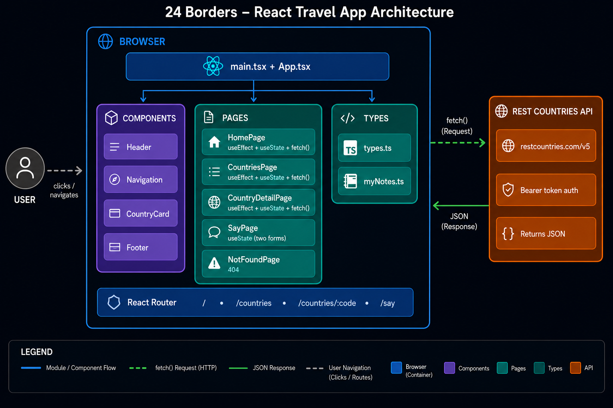

# ✈ 24 Borders

A personal travel diary built with React, TypeScript, and Tailwind CSS.

Live site: https://24-borders.vercel.app

---
## Architecture



---

## About

24 Borders is a personal project showcasing the 24 countries I have visited. Users can browse all ~250 countries in the world, view details for each one, and leave a message through the contact forms.

---

## Features

- Browse all ~250 countries with search, sort, and region filter
- View detailed information for each country — flag, capital, population, language, currency
- Personal travel notes for each of my 24 visited countries
- Two interactive forms with validation
- Dark mode toggle
- Fully responsive — works on mobile and desktop

---

## Tech Stack

- React 19
- TypeScript
- Vite
- Tailwind CSS v4
- React Router v7
- REST Countries API v5

---

## Pages

| Path | Description |
|------|-------------|
| `/` | Home page — hero section, my 24 countries, travel notes, form |
| `/countries` | All ~250 countries with search, sort, and filter |
| `/countries/:code` | Detail page for one country |
| `/say` | Two interactive forms |
| `*` | 404 page |

---

## Getting Started

```bash
# Clone the repository
git clone  https://github.com/dianadenwik/24-borders.git

# Install dependencies
cd my-travel-countries
npm install

# Add your API key
# Create .env file and add:
# VITE_API_KEY=key_here

# Start the development server
npm run dev
```

---

## Environment Variables

This project uses the REST Countries API v5 which requires an API key.

1. Register at [restcountries.com](https://restcountries.com/sign-up) — free, no credit card
2. Create a `.env` file in the root of the project
3. Add your key

---

## Author

Diana Chukhrai — HackYourFuture Netherlands, cohort c55